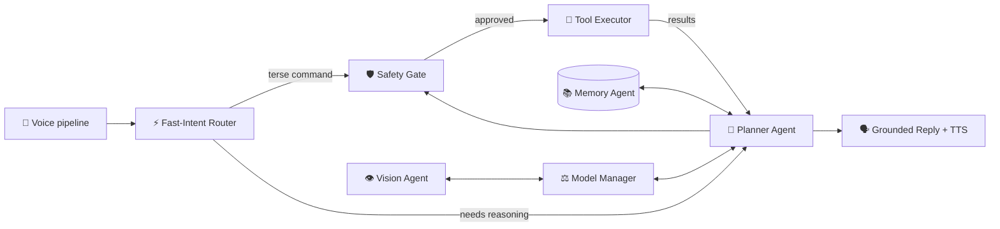

# Jarvis — a local-first AI desktop assistant for macOS

**A real, daily-driver voice assistant that runs 100% on-device.** Say *"Hey Jarvis"*
and control your Mac with natural language — open apps, manage files, play music,
send WhatsApp messages, search the web, look at your screen — powered entirely by
free, open models. No cloud. No API keys. No subscription. Works offline for most
tasks.

> **This is not a demo project.** I use Jarvis every day on my own machine, and I am
> continuously improving it — every bug I hit in real use becomes a fix, a test, and
> a commit. Expect this repository to keep advancing.

Built and tuned for modest hardware: a MacBook Air M2 with **8GB RAM**. If it runs
well here, it runs well anywhere.

---

## What you can say

| You say | Jarvis does |
|---|---|
| "What time is it?" | Reads the local clock (never the web) |
| "Check my Downloads folder" | Lists your actual files via Finder |
| "Open YouTube and play lo-fi beats" | Opens the browser, finds and plays it |
| "Send 'on my way' on WhatsApp to Amma" | Resolves the contact, sends via WhatsApp |
| "Take a screenshot" / "Look at my screen" | Captures, or describes it with a local vision model |
| "Set volume to 40" / "brightness up" | Adjusts system state instantly |
| "Remind me about the demo tomorrow at 10 AM" | Creates a real Reminder |
| "What's the latest news about SpaceX?" | Searches and opens results |
| "Create a folder named reports and list it" | Chains multiple tools in one command |

…and much more, across **50 safety-gated tools** organized into 9 categories.

## The 50 Tools

### System Control (7 tools)
- `battery_status` — Get Mac's current battery charge percentage and power state
- `brightness` — Get, set, or adjust (up/down) the display brightness
- `focus_mode` — Enable, disable, or toggle Do Not Disturb / Focus mode
- `media_control` — Control music playback (play, pause, next, previous)
- `system_power` — Restart or shut down the Mac (requires explicit approval)
- `volume` — Get, set, or adjust (up/down) the system output volume
- `window_arrange` — Move/resize app windows (left half, right half, maximize, center)

### Communication (7 tools)
- `check_email` — Check Apple Mail inbox: unread count, senders, subjects
- `reply_email` — Reply to the most recent unread email
- `send_email` — Compose and send emails through Apple Mail
- `summarize_inbox` — Read and summarize matching emails
- `whatsapp_send` — Send WhatsApp text messages via WAHA gateway
- `list_running_apps` — List all currently running applications
- `list_bluetooth_devices` — List Bluetooth devices connected to this Mac

### Information Retrieval (5 tools)
- `web_answer` — Search the web and return text from top result
- `news_search` — Search and open Google News articles by topic
- `browser_search` — Search Google or Wikipedia in the visible browser
- `brave_search_open_first` — Search Brave Search and open the first non-sponsored result
- `youtube_play` — Find and play videos on YouTube

### File Management (8 tools)
- `finder_list` — List the contents of a folder
- `finder_search` — Search files on Mac by name/content (Spotlight)
- `finder_delete` — Delete files/folders to Trash (recoverable)
- `finder_move` — Move or rename files/folders
- `finder_create_folder` — Create new folders (including parent directories)
- `finder_extract` — Extract .zip archives
- `finder_compress` — Compress files/folders into .zip archives
- `open_file` — Open files/folders with their default macOS app

### Productivity (5 tools)
- `morning_briefing` — Daily briefing: greeting, date, calendar, emails, weather, news
- `calendar` — Read your macOS Calendar events (today's, tomorrow's, or search)
- `timer` — Set a countdown timer (1-60 minutes, optional label)
- `create_reminder` — Create reminders in your default macOS Reminders list
- `clock` — Get current local date and time on this Mac

### Music & Streaming (3 tools)
- `spotify_play` — Find a song/artist on Spotify and play it
- `spotify_open_playlist` — Open a named playlist in your Spotify library
- `youtube_play` — Find and play videos on YouTube

### GitHub & Development (6 tools)
- `github_delete_repo` — Delete GitHub repositories (with strict name resolution)
- `github_push` — Create GitHub repos and push code (auto-recreates deleted remotes)
- `github_open_repo` — Open GitHub repositories in the browser
- `locate_project` — Find and report paths to local projects
- `refresh_projects` — Refresh the project registry cache
- `git` — Run git commands (status, log, diff, add, commit, push, etc)

### AI Vision (1 tool)
- `look_at_screen` — Analyze screen content with Qwen 2.5-VL vision model

### Utilities (8 tools)
- `open_app` — Open or bring macOS applications to the front
- `quit_app` — Quit running applications (may prompt to save)
- `open_url` — Open websites/URLs in your real browser
- `screenshot` — Take and save screen screenshots
- `terminal_run` — Run shell commands (zsh) and return output
- `clipboard_read` — Read the current text contents of the clipboard
- `clipboard_write` — Copy text to the clipboard (replaces current contents)
- `roll_dice` — Roll dice for decisions or games

## Why this exists

Voice assistants either live in the cloud (privacy tradeoff, subscription,
useless offline) or are toys that can't actually *do* anything. Jarvis is the third
option: a serious, extensible assistant where **everything — wake word, speech
recognition, planning, execution, memory, and speech synthesis — runs on your Mac**.
Your voice never leaves the device. Your files are read by local code, not an API.

## The multi-agent pipeline

Jarvis is not "one LLM with a prompt." It is a pipeline of specialized, cooperating
agents — each with one job, each independently testable, and the LLM is deliberately
**never trusted to execute anything itself**:



**1. Voice pipeline** — openWakeWord listens for "Hey Jarvis" continuously (tiny,
always resident). On wake, faster-whisper (Metal-accelerated) transcribes the
utterance; energy-based endpointing detects when you stop speaking. Replies are
spoken back via TTS.

**2. Fast-Intent Router** — a deterministic, regex-based agent that handles terse,
unambiguous commands ("pause", "next", "volume up", "what time is it", "check my
downloads") **without invoking the LLM at all**. Zero latency, zero hallucination
risk. Local-state questions are routed to local tools *before* any web-search logic
can steal them.

**3. Planner Agent** — a local LLM (Qwen 2.5 3B Instruct via Ollama, with a 7B
"power mode") that runs an iterative plan-act loop using native tool-calling. It
sees the conversation, the tool catalog, memory context, and prior tool results,
and either proposes the next tool call or composes the final answer. Greedy
decoding (temperature 0) keeps tool selection deterministic.

**4. Safety Gate** — every proposed call is schema-validated (Pydantic) and risk-
classified: `safe` runs immediately, `sensitive` needs one-time approval,
`destructive` (delete, shutdown, password fields) **always** requires an explicit
Allow/Deny click in the UI — the exact command shown verbatim, never a paraphrase.
The LLM can *propose*; only you can *authorize*.

**5. Tool Executor** — 50 self-contained tools implementing one interface,
auto-discovered at startup (drop a new tool file in, it just works — plugins use the
same mechanism). AppleScript, Accessibility APIs, subprocess, and Playwright under
the hood.

**6. Memory Agent** — SQLite for structured history + ChromaDB for semantic recall.
Only **tool-grounded** turns are stored as facts (a hard-won lesson: storing
ungrounded model claims creates a hallucination feedback loop that poisons future
answers).

**7. Model Manager** — enforces the 8GB reality: only one heavy model (text LLM
*or* vision model) is resident at a time, swapped through a locked state machine.
STT/TTS/wake-word are small and stay loaded. The LLM is pre-warmed at startup so
your first command answers instantly.

**8. Vision Agent** — Qwen 2.5-VL, loaded on demand (never proactively) when you
ask Jarvis to look at your screen, then swapped back out.

## Grounding & anti-hallucination engineering

Small local models lie confidently. A large share of this project is machinery that
makes a 3B model *trustworthy*:

- **No tool result → no claim.** Jarvis never says it did something without a tool
  result proving it. The prompt enforces it; the planner verifies it.
- **Hallucination detector** — if the model starts proposing repeated unrelated
  denied actions (real example: mkdir denied → it suggested *shutdown*, four
  times), the loop stops and answers honestly: "I wasn't able to work out how to
  do that."
- **Repeat-stop with grounded recovery** — when the model reissues a completed
  call, Jarvis stops the loop and forces one final tool-free turn so the reply
  answers your *original* question from real results (not the wandered tool's
  output).
- **Fake-tool-call recovery** — 3B models sometimes emit tool calls as plain JSON
  text with invented names ("web_search"); Jarvis parses and remaps them to real
  tools instead of reading JSON aloud.
- **Grounded follow-ups** — compact tool-outcome traces ride along in session
  history, so "open the screenshot you just took" knows the actual file path.
- **Speakable replies** — deterministic sanitization strips the Markdown/URL-encoded
  junk small models emit despite prompt bans, before TTS reads it.

## The user experience

- **Menu-bar native.** A SwiftUI app lives in your menu bar with a status
  indicator, a streaming chat window, and a floating voice overlay.
- **Live activity.** While tools run, the overlay shows what's happening —
  "Searching the web…", "Sending the WhatsApp message…" — streamed over WebSocket
  as each tool starts.
- **Confirmations where you are.** Sensitive actions pop Allow/Deny in the overlay,
  showing the exact action.
- **Self-managing backend.** The app attaches to a running backend or spawns its
  own (with a per-session auth token), pre-warms the model, restarts it if it
  dies, and the backend is leashed to the app's lifetime — no orphan processes,
  even after a force-kill.

## Tech stack

| Layer | Choice | Why |
|---|---|---|
| LLM | Qwen 2.5 3B Instruct Q4 (Ollama), 7B power mode | Best tool-calling per GB; non-thinking models only — reasoning models are unusably slow for voice on 8GB |
| STT | faster-whisper (Metal) | Accurate, fast, fully local |
| Wake word | openWakeWord | Keyless and offline (no accounts, unlike Porcupine) |
| TTS | macOS `say` (Piper optional) | Zero-install default; Piper wheels are flaky on arm64 |
| Vision | Qwen 2.5-VL 3B | On-demand screen understanding |
| Backend | Python 3.11, FastAPI, async | Localhost-only REST + WebSocket, bearer-token auth |
| App | SwiftUI (Swift Package, no Xcode needed) | Menu bar, overlay, chat — builds with Command Line Tools alone |
| Automation | AppleScript, PyObjC/Accessibility, Playwright | Native app control + real browser automation |
| Memory | SQLite + ChromaDB | Structured history + semantic recall |
| WhatsApp | WAHA (self-hosted gateway) | Real message sending, still fully self-hosted |
| Packaging | uv | Fast, reproducible Python environments |

## Getting started

**Prerequisites:** macOS 14+, [Ollama](https://ollama.com), [uv](https://docs.astral.sh/uv/),
Xcode Command Line Tools.

```bash
git clone https://github.com/Mohankirushna/Personal_Assistant.git
cd Personal_Assistant

# One-command setup: Python deps, Chromium, and models (~9GB with models)
scripts/setup.sh --all --with-models

# Backend
cd backend && uv run jarvis-backend       # http://127.0.0.1:8765

# Menu-bar app (separate terminal)
scripts/make_app.sh
open frontend/dist/Jarvis.app
```

Say **"Hey Jarvis"** and talk. Or use the chat window. Or test voice from the
terminal: `uv run python -m app.speech.mic_demo`.

Configuration is via environment variables / `backend/.env` — see
[backend/.env.example](backend/.env.example) for every option (models, power mode,
wake-word threshold, TTS engine, WAHA/WhatsApp, and more).

## Quality

- **549+ backend tests** (pytest): unit, API, WebSocket, and integration suites
  against the real models — including regression tests for every hallucination
  and misrouting bug found in daily use (strict GitHub resolution, briefing wake-up,
  fast-intent routing). Optional-dependency suites skip cleanly.
- **Swift self-tests** for wire decoding and client behavior (`swift run jarvis-app-selftest`).
- **ruff + mypy** clean (typed throughout), CI workflow included.
- Docs: [architecture](docs/ARCHITECTURE.md) · [API reference](docs/API.md) ·
  ADRs in [docs/adr](docs/adr).

## Privacy & security posture

- Backend binds to **loopback only** — rejected by validation otherwise.
- The app generates a **per-session bearer token**; a backend it spawns answers
  only to it.
- Voice audio, transcripts, files, and memory **never leave the machine** (the only
  network calls are the ones you ask for: web search, browser automation, WhatsApp
  via your own self-hosted gateway).
- Destructive actions cannot run without your explicit confirmation — by design,
  at the architecture level, not the prompt level.

## Roadmap

Actively developed — this list moves:

- [x] GitHub repo management (create, push, delete with strict resolution)
- [x] Morning briefing (auto-triggered on Mac wake with weather, calendar, emails, news)
- [x] Calendar access
- [x] Email management (check, send, reply, summarize)
- [x] AI Vision (screen analysis with Qwen 2.5-VL)
- [x] 50+ tools across 9 categories
- [ ] Push-to-talk global hotkey
- [ ] Tool-activity feed in the chat window (already live in the voice overlay)
- [ ] Memory dashboard — see and edit what Jarvis remembers
- [ ] Context compression for long sessions
- [ ] Multilingual voice (Whisper multilingual + matching TTS)
- [ ] Installer / one-command setup polish

## License

[MIT](LICENSE) — free to use, fork, and build on.
